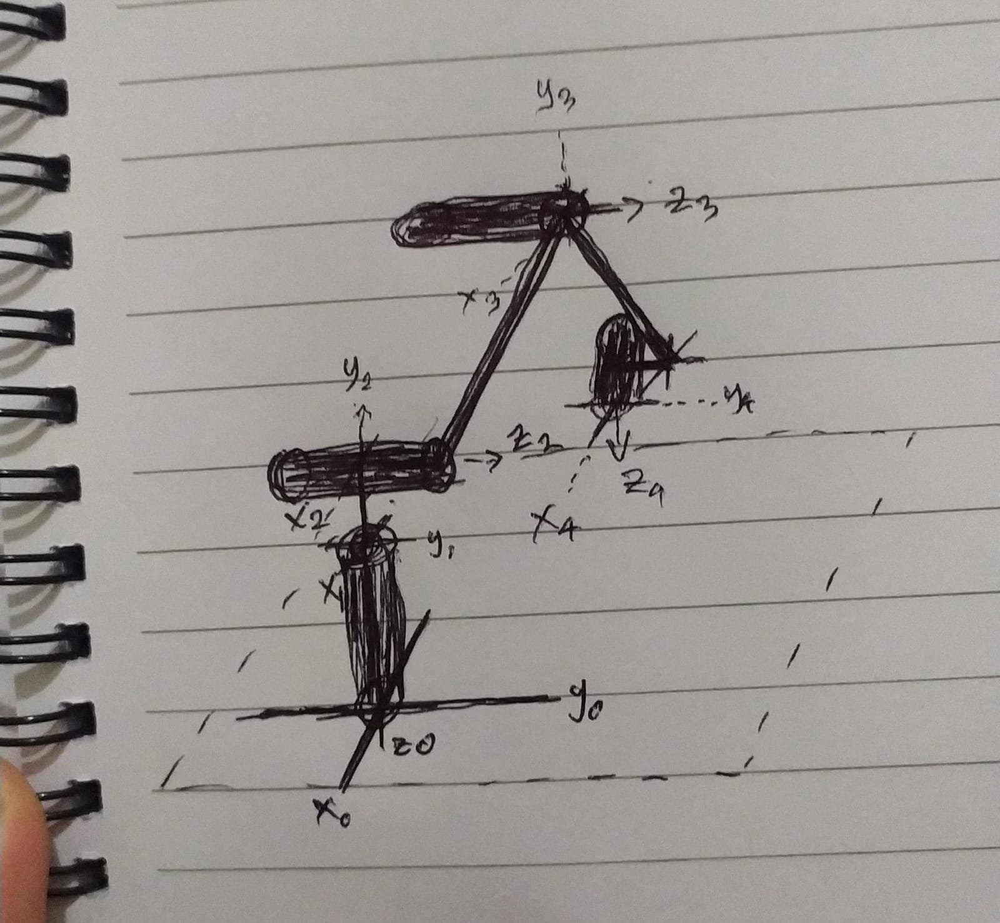
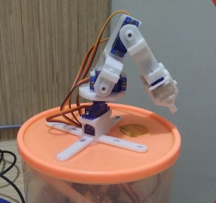

# Arm Robot Kinematic Project

  

## Hardware Used
- **MCU:** Arduino Uno
- **3D Printed Arm Robot Structure:**
  - 3 Revolute Joints
  - 1 Fixed Joint for gripping things
- **Servos:** 4 Servos
- **Breadboard & Wire:**
- **Case:** Case to cover the MCU and breadboard

## Method
The kinematics of the arm robot are determined using the k-nearest neighbors (KNN) algorithm, specifically its Euclidean range method. The x, y, z data are collected through actual measurements using the servos as the independent variables. The x, y, z values are stored to calculate the Euclidean distance between the collected and desired x, y, z coordinates.

## Future Development
In the future, I plan to enhance the capabilities of the robot by incorporating machine learning. The goal is to enable the robot to move according to camera input, opening up possibilities for more interactive and dynamic functionalities.

## Project Showcase
Here are some snapshots of the Arm Robot in action:

  

Feel free to explore the [presentation](https://www.canva.com/design/DAF0f6DqohE/guJJtTS7xdrXKduJhdChsw/edit?utm_content=DAF0f6DqohE&utm_campaign=designshare&utm_medium=link2&utm_source=sharebutton) to see the Arm Robot Kinematic project in action!
